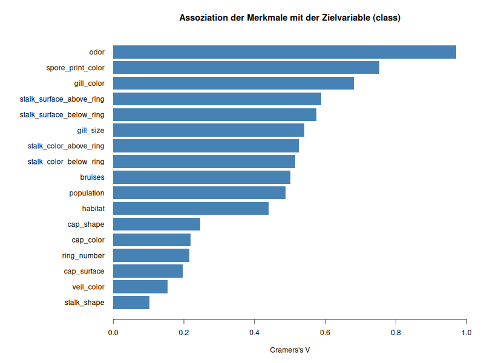
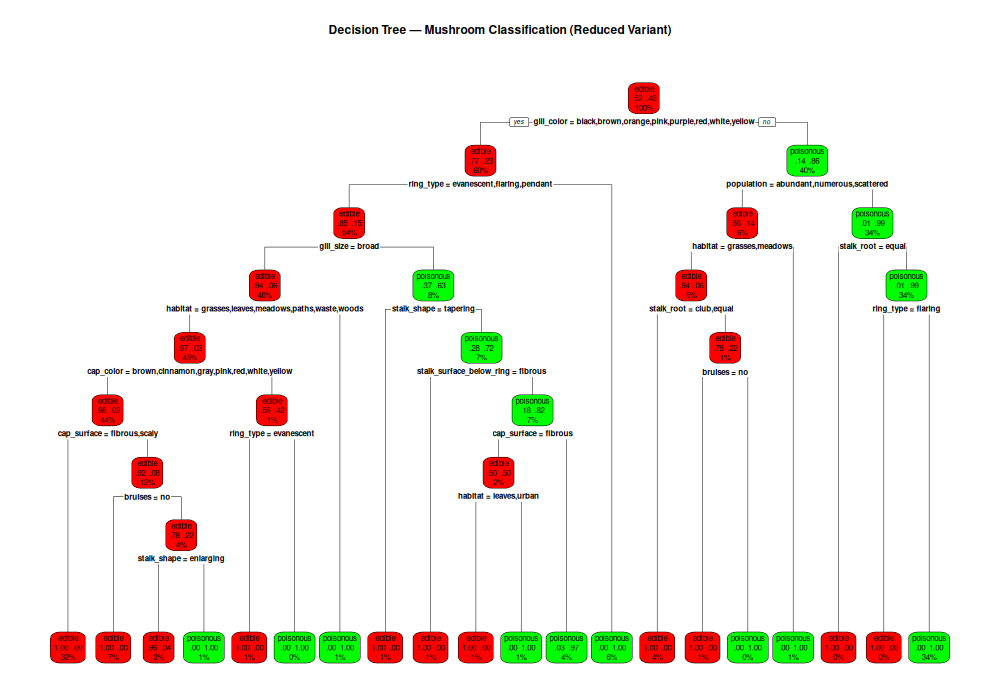
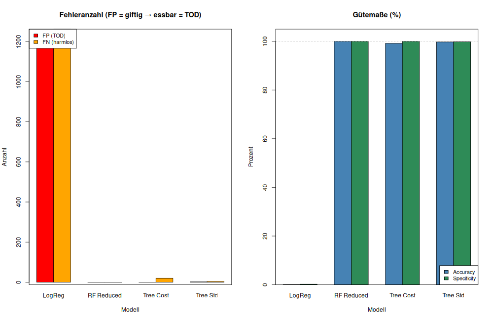

# Mushroom Classification — Prüfungsstudienarbeit SS2026

**Maschinelles Lernen** | TH Deggendorf

Binäre Klassifikation von Pilzen in **essbar (edible)** vs. **giftig (poisonous)** auf Basis des [UCI Mushroom Datasets](https://archive.ics.uci.edu/dataset/73/mushroom) (8.124 Instanzen, 22 nominale Merkmale). Drei supervised Learning-Verfahren verglichen — mit Fokus auf Asymmetrische Kosten (FP = tödlich, FN = harmlos).

---

## Auf einen Blick

| Aspekt | Ergebnis |
|---|---|
| Dataset | UCI Mushroom, 8.124 × 22, nur nom. Merkmale |
| Train/Test | 70/30 stratified |
| Logistic Regression | **Perfect Separation** — konvergiert nicht (lehrreicher Fail) |
| Decision Tree (Standard) | 99,75% Accuracy, 2 FP |
| Decision Tree (Cost-sensitive) | **0 FP**, 99,18% Accuracy — **Praxisempfehlung** |
| Random Forest | **0 FP + 0 FN**, 100% Accuracy, AUC = 1,0 |
| Reduced-Variante | 19 Features (ohne odor + spore_print_color) für realistischeres Pilzsammler-Szenario |

## Projektstruktur

```
├── src/                    # R-Skripte (00_Main.R orchestriert alle Schritte)
│   ├── 01_preprocessing.R
│   ├── 02_descriptive_analysis.R
│   ├── 03_train_test_split.R
│   ├── 04_model_logistic.R
│   ├── 05_model_tree.R
│   ├── 06_model_rf.R
│   └── plots_comparison.R
├── data/
│   ├── raw/                # mushroom.csv
│   └── processed/          # RDS-Dateien (train/test/modelle)
├── docs/
│   ├── presentation/       # Marp-Folien (.md + .html + notes)
│   ├── plots/              # 6 Grafiken
│   ├── *.md                # Dokumentation aller Schritte
│   └── evaluation.md       # Evaluations-Laufzettel
├── virt/                   # Vorlesungsunterlagen, AGENTS.md, Aufgabenstellung
└── README.md
```

## Die 3 wichtigsten Einblicke

### 1. Perfekte Indikatoren — das Kernproblem des Datensatzes



5 Merkmale haben Ausprägungen, die die Klassen **perfekt trennen** (z. B. `odor = almond` → immer essbar, `odor = fishy` → immer giftig). Das verursacht **Perfect Separation** bei der logistischen Regression und macht das Problem trügerisch einfach. `gill_color` bleibt als praxistaugliches Bestimmungsmerkmal in der Reduced-Variante.

### 2. Cost-sensitive Decision Tree — interpretierbar und sicher



Der Baum liefert bei 10-facher FP-Bestrafung **0 tödliche Fehler** (FP = 0). Die Baumregeln sind vollständig nachvollziehbar — entscheidend für einen Pilzsammler, der verstehen muss, *warum* ein Pilz als giftig eingestuft wird.

### 3. Modellvergleich — Performance vs. Transparenz



RF erreicht perfekte Klassifikation (0 FP + 0 FN), ist aber eine Blackbox. Der Cost-sensitive Tree hat minimale FN (20 = harmlos), bleibt aber erklärbar. **Empfehlung:** Cost-sensitive Tree für die Praxis, RF als wissenschaftlicher Benchmark.

## Dokumentation

| Thema | Datei |
|---|---|
| Datenaufbereitung & Preprocessing | [`docs/data.md`](docs/data.md) |
| Deskriptive Analyse | [`docs/descriptive_analysis.md`](docs/descriptive_analysis.md) |
| Train/Test-Split | [`docs/train_test_split.md`](docs/train_test_split.md) |
| Logistische Regression (Perfect Separation) | [`docs/logistic_regression.md`](docs/logistic_regression.md) |
| Decision Tree (Standard + Cost-sensitive) | [`docs/decision_tree.md`](docs/decision_tree.md) |
| Random Forest (Tuning + OOB + ROC) | [`docs/random_forest.md`](docs/random_forest.md) |
| Evaluations-Laufzettel | [`docs/evaluation.md`](docs/evaluation.md) |
| Präsentationsfolien (Marp) | [`docs/presentation/presentation.md`](docs/presentation/presentation.html) |
| Sprechernotizen | [`docs/presentation/presentation_notes.md`](docs/presentation/presentation_notes.md) |
