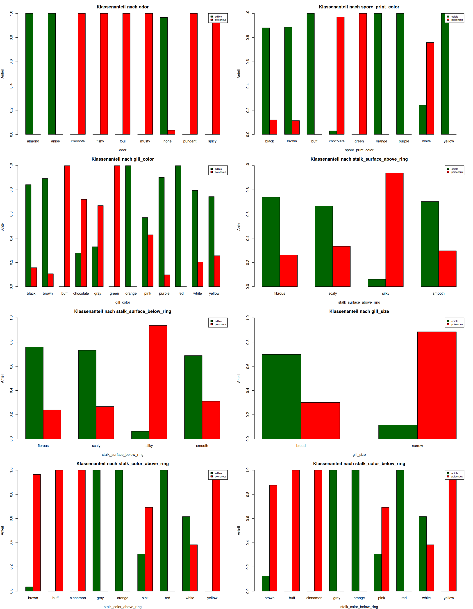

# Maschinelles Lernen -- Mushroom Classification

**Binäre Klassifikation: essbar vs. giftig**

UCI Mushroom Dataset . TH Deggendorf . SS2026

---

<!-- note: Hier erklären, dass die Aufgabenstellung "3 alternative supervised learning methods" aus Kapitel 4--9 der Vorlesung verlangt. Wir haben LogReg (Kap 4.1), Decision Tree (Kap 4.1) und Random Forest (Kap 4.1/Ensemble) gewählt. Der Datensatz ist der UCI Mushroom Dataset, ein Standard-Datensatz für Klassifikation mit 22 nominalen Merkmalen. -->

## Problemstellung

**Ziel:** Unterscheidung essbarer und giftiger Pilze anhand von 22 Merkmalen (Hutform, Farbe, Geruch, Lamellen, Stiel, Lebensraum, ...)

### Entscheidend: Asymmetrische Kosten

| Fehler | Bedeutung | Konsequenz |
|---|---|---|
| **FP** (giftig -> essbar) | Giftpilz als essbar eingestuft | [!] **Tödlich** |
| FN (essbar -> giftig) | Essbarer Pilz als giftig eingestuft | Pilz wird nicht gegessen (harmlos) |

> **Kernerkenntnis:** Ein Klassifikator muss zuerst **Specificity** (Richtig-negativ-Rate) maximieren -- und nicht Accuracy. Ein falsch-positiver Pilz (giftig->essbar) darf nicht vorkommen.

---

<!-- note: Der Datensatz hat 8.124 Instanzen, 22 nominale Merkmale + Zielvariable. Jedes Merkmal hat 2--12 Ausprägungen (kodiert als einzelne Buchstaben). Fehlende Werte gibt es nur in stalk_root (30x "?"), die mit dem Modalwert bulbous (häufigste Ausprägung) imputiert wurden. veil_type war konstant (nur "partial") und wurde gemäß Kap 3.1 (Entfernen irrelevanter Daten) gestrichen. -->

## Datensatz

| Kennzahl | Wert |
|---|---|
| Instanzen | 8.124 |
| Merkmale | 22 nominal (2--12 Levels) |
| Zielvariable | `class`: edible (51,8%) / poisonous (48,2%) |
| Fehlende Werte | nur `stalk_root` (30x `?`) -> modalimputiert |
| Konstant | `veil_type` -> entfernt (Ch. 3.1) |

---

## Deskriptive Analyse: Cramers's V

**Cramers's V** misst die Stärke des Zusammenhangs jedes Merkmals mit `class`.

| Rang | Merkmal | Cramers's V | Interpretation |
|---|---|---|---|
| 1 | **odor** (Geruch) | **0,971** | [!] nahezu perfekte Trennung |
| 2 | **spore_print_color** (Sporenfarbe) | 0,753 | sehr stark |
| 3 | **gill_color** (Lamellenfarbe) | 0,681 | stark |
| 4 | stalk_surface_above_ring | 0,588 | mäßig |
| 5 | stalk_surface_below_ring | 0,575 | mäßig |
| 6 | gill_size | 0,540 | mäßig |
| ... | ... | ... | |
| 21 | stalk_shape | 0,102 | sehr schwach |


> **Kernerkenntnis:** `odor` dominiert mit 0,971. 7 von 9 Geruchsausprägungen sind **100%-Indikatoren** -- das macht den Datensatz für manche Modelle zu einfach (und für andere kaputt).

---

<!-- note: Die perfekten Indikatoren sind zentral: jedes dieser Features hat Ausprägungen, die zu 100% mit einer Klasse einhergehen. odor und spore_print_color sind die stärksten -- aber fürs Pilzsammeln ungeeignet (nächste Folie). gill_color und stalk_color bleiben in Reduced drin. Dass sie auch perfekte Levels haben, führt zum glm-Fail -- aber Tree-Methoden kommen damit klar. -->

## Perfekte Indikatoren -- das Kernproblem

Mehrere Merkmale haben Ausprägungen, die die Klassen **perfekt trennen**:

| Merkmal | 100% essbar | 100% giftig |
|---|---|---|
| `odor` | almond, anise | creosote, fishy, foul, musty, pungent, spicy |
| `spore_print_color` | buff, orange, purple, yellow | green |
| `gill_color` | orange, red | buff, green |
| `stalk_color_above_ring` | gray, orange, red | buff, cinnamon, yellow |
| `stalk_color_below_ring` | gray, orange, red | buff, cinnamon, yellow |



> **Kernerkenntnis:** Der Datensatz wurde für regelbasierte Bestimmung konzipiert. Diese Merkmale machen das Problem trügerisch einfach -- Modelle, die sie nutzen, werden scheinbar perfekt, ohne wirklich gelernt zu haben.

---

<!-- note: Nachdem die deskriptive Analyse gezeigt hat, dass odor und spore_print_color das Problem dominieren, stellen wir jetzt die Frage: Sind diese Merkmale im Anwendungskontext überhaupt sinnvoll? Die Antwort für das Pilzsammler-Szenario ist klar: Nein. Geruch ist situationsabhängig und Sporenabdruck ist Laborarbeit. Also wird auf Reduced trainiert, wo sich die echten Unterschiede zwischen den Modellen zeigen. -->

## Reduzierte Variante -- Pilzsammler-Szenario

### Erkenntnis aus der Analyse

`odor` (Cramers's V = 0,971) und `spore_print_color` (0,753) dominieren die Klassifikation. Sie haben Levels, die die Klassen perfekt trennen -- aber sind sie im Feld praktikabel?

| Merkmal | Cramers's V | Problem |
|---------|:----------:|---------|
| `odor` | **0,971** | **Situationsabhängig vergänglich:** Geruch verfliegt bei Alterung/Trocknung, wird im Wald von Umgebungsgerüchen überlagert. Sporengefahr beim Riechen. |
| `spore_print_color` | **0,753** | **Kein Feldmerkmal:** Sporenabdruck benötigt 2--6 Stunden + Papier -> für Pilzsammler unterwegs nicht machbar. |

### Konsequenz: Reduced-Variante (19 Features)

-> `gill_color` (0,681) bleibt drin -- Standard-Bestimmungsmerkmal, frisch gut erkennbar
-> Alle Modelle werden auf dieser Variante trainiert und evaluiert

> **Kernerkenntnis:** Die Reduced-Variante bildet ab, was ein Pilzsammler **vor Ort und ohne Hilfsmittel** bestimmen kann. Das ist der relevante Use Case -- und hier zeigt sich der echte Unterschied zwischen den Verfahren.

---

<!-- note: Ch. 5.5 der Vorlesung: Der Datensatz wird in Trainings- und Testdaten aufgeteilt. Der Testdatensatz wird NUR für die finale Evaluation verwendet. Tuning (Parameterwahl) erfolgt ausschließlich über die 10-fold CV auf dem Trainingsdatensatz. Verweis auf Ch. 6.1: "Durch das Tunen auf dem Testdatensatz haben wir den Testdatensatz als Validierungsdatensatz missbraucht." -->

## Train/Test Split & Cross-Validation

**Stratifizierter 70/30 Split** (set.seed(467), Ch. 5.5)

| Datensatz | Zeilen | edible | poisonous | Anteil |
|---|---|---|---|---|
| Gesamt | 8.124 | 4.208 | 3.916 | 51,8% / 48,2% |
| Training (70%) | 5.687 | 2.946 | 2.741 | 51,8% / 48,2% |
| Test (30%) | 2.437 | 1.262 | 1.175 | 51,8% / 48,2% |

### Tuning mit 10-fold Cross-Validation (Ch. 6.3)

- Nur auf dem **Trainingsdatensatz**
- 10 Folds -> 9 trainieren, 1 validieren -> mitteln
- **1-SE-Regel:** Wähle den einfachsten Modellparameter, dessen Fehler innerhalb von 1 Standardabweichung des Minimums liegt
- Testdaten bleiben bis zur finalen Evaluation **unangetastet**

> **Kernerkenntnis:** Klassenproportionen bleiben durch Stratifikation erhalten. Testdaten sind "heilig" -- keine Parameterwahl auf ihnen.

---

<!-- note: glm (Ch. 4.1) ist das einfachste aller Verfahren. Schätze Koeffizienten via Maximum Likelihood, sigmoid am Ende. Auch auf der Reduced-Variante scheitert glm -- nicht weil wir zu wenig Features entfernt hätten, sondern weil die Methode mit deterministischen Levels nicht umgehen kann. Bäume machen das besser: nächste Folie. Zeigen Sie die R-Ausgaben als harte Belege. -->

## Methode 1: Logistische Regression (glm)

### Perfect Separation -- R-Ausgaben zeigen das Problem

```r
> glm(class ~ ., data = train_reduced, family = binomial)
glm.fit: algorithm did not converge
glm.fit: fitted probabilities numerically 0 or 1 occurred
```

| Indikator | R-Ausgabe | Bedeutung |
|-----------|-----------|-----------|
| Koeffizienten | `cinnamon: 252,5` / `rooted: -198,0` | beta -> +-/unendl |
| Standardfehler | `1,75e+05` / `1,24e+05` | Keine Schätzgenauigkeit |
| **Singularitäten** | **6 nicht definiert (NA)** | **Multikollinearität** |
| Residual Deviance | `6,51e-08` (Null: 7876) | Degenerierter Fit |
| Confusion Matrix | 1172 FP, 1262 FN, Acc: 0,12% | Nicht verwertbar |

**Lehrbuchbezug (Ch. 4.1):** *"Bei perfekter Trennung existiert der ML-Schätzer nicht."*

> **Kernerkenntnis:** Deterministische Levels brechen die simultane ML-Schätzung. Das ist kein Feature-Problem, sondern ein **Methodenproblem** -- Bäume splitten solche Fälle in Blattknoten (nächste Folie).

---

<!-- note: Was lernen wir aus dem LogReg-Scheitern? Dass nicht jedes Verfahren zu jedem Datensatz passt. Die logistische Regression ist kein Allheilmittel -- sie hat strukturelle Grenzen. Deterministische Levels + simultane ML-Schätzung = nicht kombinierbar. Bäume sind die logische Alternative. -->

## Methode 1: Logistische Regression -- Fazit

### Was lernen wir daraus?

- LogReg scheitert nicht an Implementierung, sondern an **struktureller Limitierung**: Deterministische Levels -> ML-Schätzer existiert nicht (Ch. 4.1)
- **Mögliche Fixes:** Firth's Bias-Reduktion (`logistf`) oder LASSO (Ch. 9.3, `glmnet`) -- würden Koeffizienten regularisieren
- Für diesen Datensatz aber: **Bäume sind der bessere Ansatz** -- sie nutzen deterministische Levels als Blattknoten

> **Fazit:** Die Methode muss zur Datenstruktur passen -- nicht umgekehrt. LogReg ist kein Allheilmittel, sondern ein Werkzeug mit spezifischen Voraussetzungen.

---

<!-- note: Entscheidungsbäume (Ch. 4.1) partitionieren den Merkmalsraum rekursiv. Anders als LogReg schätzen sie keine Koeffizienten, sondern suchen gierig den besten Split. Deterministische Levels werden sofort zu Blattknoten -- kein Problem. Tuning des cp-Parameters via 10-fold CV + 1-SE-Regel. Die Evaluierung zeigt den Vergleich Standard vs. Cost-sensitive, der asymmetrische Kosten abbildet. -->

## Methode 2: Decision Tree -- Ergebnisse

### Evaluierung: Standard Tree vs. Cost-sensitive Tree

| Metrik | Standard (1:1) | Cost-sensitive (10x) |
|---|---|---|
| **FP (TOD)** | **2** | **0 [OK]** |
| FN (harmlos) | 4 | 20 |
| Accuracy | 99,75% | 99,18% |
| Specificity | 99,83% | **100% [OK]** |

**Eckpunkte:**
- cp-Tuning via 10-fold CV + 1-SE-Regel -> 38 Splits, 11 Merkmale
- Cost-Matrix: FN = 10x Kosten -> eliminiert tödliche Fehler
- Wurzel-Split: `stalk_color_above_ring` (erkennbar im Baum)


---

<!-- note: Was lernen wir aus dem Decision Tree? Cost-sensitive Learning ist der richtige Ansatz für asymmetrische Kosten. Der Baum liefert 0 TOD bei voller Interpretierbarkeit -- das ist für die Praxis entscheidend. Die 20 FN sind harmlos (Pilz wird nicht gegessen). Der Preis für Interpretierbarkeit ist etwas niedrigere Accuracy (99,18% vs. RF 100%). -->

## Methode 2: Decision Tree -- Fazit

### Was lernen wir daraus?

- Cost-sensitive Ansatz eliminiert **alle tödlichen Fehler** (0 FP)
- Der Baum ist **voll interpretierbar** -- die Regeln können von Menschen nachvollzogen werden
- cp-Tuning + 1-SE-Regel sorgt für **robuste Generalisierung**
- **Trade-off:** 20 FN (harmlos) vs. RF's 0 FN -- aber dafür **erklärbar**

> **Fazit:** Der Cost-sensitive Decision Tree ist die **beste Wahl für die Praxis**: 0 tödliche Fehler, robust getuned, und jeder Entscheidungspfad ist nachvollziehbar.

---

<!-- note: Random Forest (Kap 4.1 als Ensemble-Erweiterung von Bäumen) zieht B Bootstrap-Stichproben und trainiert auf jeder einen Baum. Beim Split wird nicht über alle Merkmale optimiert, sondern über eine zufällige Teilmenge (mtry). Das reduziert die Korrelation zwischen den Bäumen und verbessert die Generalisierung. OOB (Out-of-Bag) Fehler ersetzen die CV. Vorteil: meist beste Accuracy. Nachteil: nicht mehr voll interpretierbar (Blackbox). Trotzdem kann man Variable Importance berechnen. -->

## Methode 3: Random Forest

### Idee (Ch. 4.1, Ensemble-Erweiterung)

- **B** Bootsrap-Stichproben aus den Trainingsdaten
- Auf jeder Stichprobe einen Entscheidungsbaum wachsen (ungekürzt, groß)
- Beim Split: nur eine **zufällige Teilmenge** der Merkmale prüfen (`mtry`)
- Vorhersage: **Majority Vote** aller Bäume

### Vorteile

| Aspekt | Einzelbaum | Random Forest |
|---|---|---|
| Varianz | Hoch (instabil) | [OK] **Niedrig** (mittelt über Bäume) |
| Overfitting | Anfällig (tiefe Bäume) | [OK] **Robust** (Law of Large Numbers) |
| Feature Importance | Nicht direkt | [OK] **Variable Importance** Plot |
| Interpretierbarkeit | [OK] Vollständig | [NEIN] Blackbox |


### Ergebnis (Reduced)

| Metrik | Wert |
|--------|------|
| **FP (TOD)** | **0** |
| FN (harmlos) | 0 |
| Accuracy | **100,00%** |
| Specificity | 100,00% |
| AUC | 1,000 |
| OOB Error | 0,00% |

RF erreicht auf der Reduced-Variante **perfekte Klassifikation** (0 FP, 0 FN) -- besser als jeder Einzelbaum. Das Ensemble aus 500 Bäumen fängt alle subtilen Muster ein.

> **Kernerkenntnis:** RF ist der **stärkste Klassifikator** (perfekte Metriken), aber eine Blackbox. Der Cost-sensitive Tree bleibt erklärbar (0 FP, 20 FN) -- **Trade-off: Performance vs. Transparenz**.

---

<!-- note: Was lernen wir aus dem Random Forest? Dass Ensemble-Methoden die maximale Performance liefern -- aber um den Preis der Interpretierbarkeit. Für die Forschung und maximale Genauigkeit ist RF die erste Wahl. Für die Praxis (Pilzsammler) ist der erklärbare Tree die bessere Wahl, weil er die gleiche Sicherheit bei voller Transparenz bietet. -->

## Methode 3: Random Forest -- Fazit

### Was lernen wir daraus?

- RF erreicht **perfekte Klassifikation** auf Reduced: 0 FP, 0 FN, 100% Accuracy, AUC = 1,000
- Ensemble aus 500 Bäumen + zufällige Merkmalsauswahl (`mtry = 11`) fangen alle Muster
- Variable Importance bestätigt: `gill_color` + `stalk_color` dominieren

### Maximale Performance vs. Interpretierbarkeit

| Kriterium | Cost-sensitive Tree | Random Forest |
|---|---|---|
| FP (TOD) | **0** | **0** |
| FN | 20 | **0** |
| Accuracy | 99,18% | **100%** |
| Interpretierbar | **[OK] Ja** | [NEIN] Nein |
| Empfehlung | **Praxis** | Forschung / Second Opinion |

> **Fazit:** RF ist leistungsstärker, aber für die Praxis nicht nötig. Der erklärbare Tree erreicht das gleiche Sicherheitsziel (0 FP).

---

<!-- note: Hier ist der finale Vergleich auf der Reduced-Variante. Wichtig: Nicht nur Accuracy vergleichen, sondern vor allem FP (tödlich) und FN (harmlos). Der Modellvergleich fasst alle drei Methoden auf einen Blick zusammen. -->

## Modellvergleich


**Reduced-Variante (19 Features, Pilzsammler-Szenario):**

| Modell | FP (TOD) | FN | Accuracy | Specificity | Interpretierbar |
| LogReg (glm) | [NEIN] 1172* | 1262* | 0,12%* | 0,26%* | [NEIN] (nicht konvergiert) |
| **Tree Cost-sensitive** | **[OK] 0** | 20 | 99,18% | **100%** | **[OK] Voll** |
| Tree Standard | 2 | 4 | 99,75% | 99,83% | [OK] Voll |
| **RF Reduced** | **[OK] 0** | **0** | **100%** | **100%** | [NEIN] (Blackbox) |

*\*Werte ungültig wegen Non-Convergence*

> **Kernerkenntnis:** **RF Reduced** ist nach Metriken das beste Modell (0 FP, 0 FN, 100%). Der **Cost-sensitive Tree** liefert ebenfalls 0 FP und ist **voll interpretierbar** -- für die Praxis die bessere Wahl.

---

<!-- note: Das Fazit fasst die übergreifenden Erkenntnisse zusammen. Nicht mehr pro Modell (das hatten wir schon), sondern methodenübergreifend. Die Kernbotschaft: Cost-sensitive Tree für die Praxis, RF als Benchmark. Und: Methodenwahl hängt von Datenstruktur UND Anwendungskontext ab. -->

## Fazit

### Methodische Erkenntnisse

| Erkenntnis | Bedeutung für diese Arbeit |
|---|---|
| **Methodenwahl != Datensatz** | LogReg scheitert an nominalen Daten mit deterministischen Levels |
| **Asymmetrische Kosten** | Loss Matrix im Modell (nicht nachträglich) -- nur so wird FP vermieden |
| **Einfach + erklärbar > komplex + Blackbox** | Cost-sensitive Tree (0 FP) ist RF (0 FP) für die Praxis vorzuziehen |
| **Datenverständnis vor Modellierung** | Deskriptive Analyse zeigte: Reduced-Variante ist der relevante Use Case |

### Zusammenfassung

| Aspekt | Gewähltes Modell | Begründung |
|---|---|---|
| **Praxis (Pilzsammler)** | **Decision Tree (Cost-sensitive)** | 0 FP, interpretierbar, robust (1-SE) |
| **Forschung (max. Performance)** | **Random Forest** | 0 FP, 0 FN, 100% Accuracy |

> **Fazit:** Der Cost-sensitive Decision Tree ist die **Empfehlung für die Praxis** -- er kombiniert 0 tödliche Fehler mit voller Interpretierbarkeit. Random Forest als "Second Opinion" für maximale Genauigkeit.

---

<!-- note: Abschlussfolie -- kein Fachinhalt mehr. Danke und Fragen. Je nach Zeit kann man auf die Baumregeln eingehen oder die Cost-Matrix genauer erklären. -->

# Vielen Dank!

**Fragen & Diskussion**

---

*Prüfungsstudienarbeit "Maschinelles Lernen" SS2026*
*TH Deggendorf . Prof. Hable*
*Code & Dokumentation: github.com/...*
