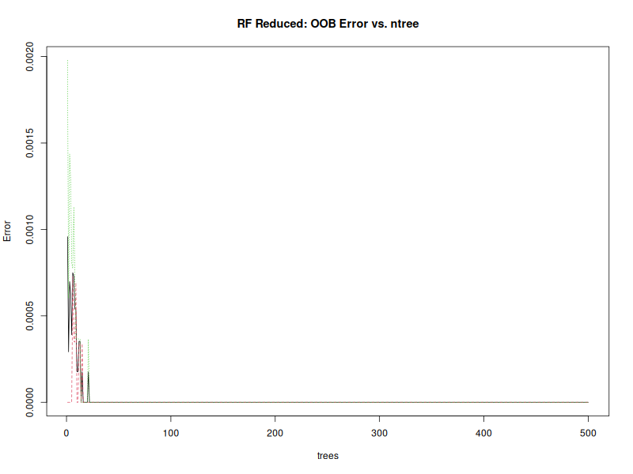
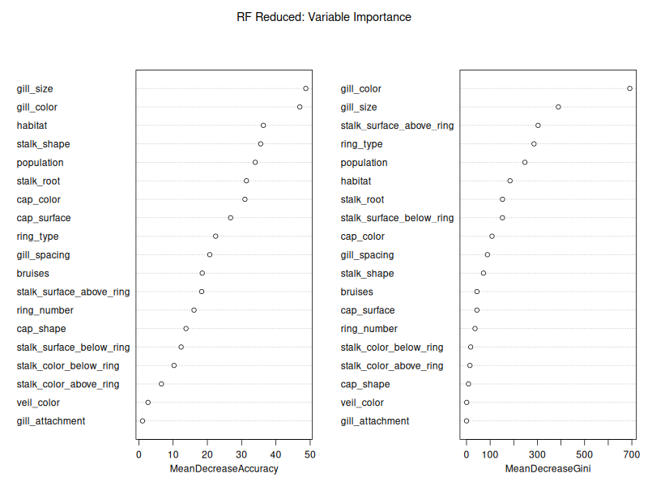

# Random Forest — Modellanalyse

## 1. Funktionsweise (Ch. 4.1, Ensemble-Erweiterung)

Random Forest kombiniert zwei Ideen: **Bagging** (Bootstrap-Aggregation) und **zufällige Merkmalsauswahl**:

1. **B** Bootstrap-Stichproben aus den Trainingsdaten (jede Stichprobe ~63,2% der Daten, der Rest ist OOB)
2. Auf jeder Stichprobe wird ein **ungekürzter Entscheidungsbaum** trainiert
3. An jedem Split wird nur eine **zufällige Teilmenge** der Merkmale ($m_{try}$) geprüft
4. Vorhersage per **Majority Vote** aller Bäume

Dadurch sind die Bäume **weniger korreliert** als beim einfachen Bagging: Jeder Baum sieht andere Daten und andere Feature-Kombinationen. Das Mitteln über viele (teilweise unkorrelierte) Bäume reduziert die Varianz drastisch.

### 1.1 Out-of-Bag (OOB) Fehler

Jede Bootstrap-Stichprobe lässt ~36,8% der Daten ungenutzt (OOB). Diese können als **built-in Validation** dienen: Für jede Beobachtung wird der Fehler der Bäume gemessen, die sie nicht gesehen haben. Der OOB-Fehler ist eine unverzerrte Schätzung des Generalisierungsfehlers und ersetzt in RF typischerweise die Kreuzvalidierung.

### 1.2 Variable Importance

RF liefert zwei Importance-Maße:
- **Mean Decrease in Accuracy:** Permutiert man ein Merkmal und misst den Accuracy-Verlust über die OOB-Daten, erhält man die Wichtigkeit für die Vorhersage
- **Mean Decrease in Gini:** Summe der Gini-Reduktionen über alle Splits, in denen dieses Merkmal verwendet wurde

### 1.3 Vorteile für diesen Datensatz

| Aspekt | Einzelbaum (rpart) | Random Forest |
|--------|-------------------|---------------|
| Varianz | Hoch (instabil) | **Niedrig** (mittelt über Bäume) |
| Overfitting | Anfällig (tiefe Bäume) | **Robust** (Law of Large Numbers) |
| Feature Importance | Nicht direkt | **Variable Importance** |
| Interpretierbarkeit | **Vollständig** | Blackbox (kein einzelner Baum) |

## 2. mtry-Tuning mit 10-fold CV

Der wichtigste Parameter in RF ist $m_{try}$ — die Anzahl der Merkmale, die an jedem Split zufällig ausgewählt werden:

| Features | $m_{try}$ Default ($\sqrt{p}$) | $m_{try}$ getestet | Beste $m_{try}$ |
|----------|-------------------------------|-------------------|-----------------|
| 19 | 4 | 2–12 | **11** |

### 2.1 CV-Ergebnisse (Reduced)

```
mtry =  2: CV Accuracy = 0.9645
mtry =  3: CV Accuracy = 0.9670
mtry =  4: CV Accuracy = 0.9667
mtry =  5: CV Accuracy = 0.9665
mtry =  6: CV Accuracy = 0.9668
mtry =  7: CV Accuracy = 0.9665
mtry =  8: CV Accuracy = 0.9672
mtry =  9: CV Accuracy = 0.9672
mtry = 10: CV Accuracy = 0.9675
mtry = 11: CV Accuracy = 0.9700  ← best
mtry = 12: CV Accuracy = 0.9695
```

Höhere $m_{try}$-Werte schneiden leicht besser ab als die Default-Einstellung (4). Dies liegt daran, dass im Reduced-Datensatz mehrere starke Prädiktoren (`gill_color`, `gill_size`) existieren, die mit größeren $m_{try}$ häufiger für Splits zur Verfügung stehen.

### 2.2 OOB Error Plot



Der OOB-Fehler fällt bereits nach ~50 Bäumen auf nahe 0% und stabilisiert sich bei ~0,00% für $n_{tree} = 500$.

## 3. Variable Importance



**Top-5 (Mean Decrease Gini):**

| Rang | Merkmal | Mean Decrease Gini | Bedeutung |
|------|---------|-------------------|-----------|
| 1 | `gill_color` | 691.3 | Lamellenfarbe — stärkster Prädiktor |
| 2 | `gill_size` | 388.9 | Lamellengröße |
| 3 | `stalk_surface_above_ring` | 303.0 | Stieloberfläche über Ring |
| 4 | `ring_type` | 285.8 | Ring-Typ |
| 5 | `population` | 247.1 | Wuchsform |

Die Importance-Reihenfolge bestätigt die Cramér's V-Analyse: `gill_color` und `gill_size` dominieren die Klassifikation. `stalk_surface_above_ring` und `ring_type` sind ebenfalls wichtige Merkmale — beide haben starke Assoziationen mit Giftigkeit (manche Ring-Typen, z.B. `large`, kommen fast nur bei giftigen Pilzen vor).

**Schwächste Merkmale:** `veil_color`, `gill_attachment` — diese haben kaum trennende Kraft und könnten theoretisch entfernt werden.

## 4. Modellergebnisse

### 4.1 Confusion Matrix

| | Tatsächlich edible | Tatsächlich poisonous |
|---|---|---|
| **Vorhergesagt edible** | 1262 (TP) | **0 (FP = TOD)** |
| **Vorhergesagt poisonous** | 0 (FN) | 1175 (TN) |

RF erreicht **perfekte Klassifikation** auf dem Testdatensatz (2.437 Instanzen) — **0 tödliche Fehler** (FP), **0 harmlose Fehlalarme** (FN).

### 4.2 Metriken

| Metrik | Wert |
|--------|------|
| Accuracy | **100,00%** |
| Sensitivity | **100,00%** |
| Specificity | **100,00%** |
| Precision | **100,00%** |
| Balanced Accuracy | **100,00%** |
| FN (giftig→essbar=TOD) | **0** |
| FP (essbar→giftig) | **0** |
| AUC | **1,000** |
| OOB Error | **0,00%** |

### 4.3 ROC-Kurve

Die ROC-Kurve erreicht AUC = 1,000 — der perfekte Klassifikator. Der Cost-sensitive Tree hatte ebenfalls AUC = 1,000 (Specificity = 100%).

## 5. Vergleich: Random Forest vs. Decision Tree

| Metrik | RF Reduced | Tree Cost (10x) | Tree Std (1:1) |
|--------|------------|-----------------|----------------|
| **FP (TOD)** | **0** | **0** | 2 |
| FN (harmlos) | **0** | 20 | 4 |
| Accuracy | **1,0000** | 0,9918 | 0,9975 |
| Sensitivity | **1,0000** | 0,9842 | 0,9968 |
| Specificity | **1,0000** | **1,0000** | 0,9983 |
| Interpretierbar | Nein | **Ja** | **Ja** |

### 5.1 Interpretation

- **RF Reduced** ist das **beste Modell nach Metriken**: 0 FP, 0 FN, 100% Accuracy
- **Tree Cost-sensitive** erreicht ebenfalls 0 FP, aber auf Kosten von 20 FN (harmlose Fehlalarme)
- Der **Trade-off**: RF Reduced ist eine **Blackbox** (keine nachvollziehbaren Regeln), der Cost-sensitive Tree ist **voll interpretierbar**

### 5.2 Warum ist RF perfekt, der Einzelbaum aber nicht?

Der Einzelbaum (selbst Cost-sensitive) erreicht "nur" Spezifität 100% mit 20 FN. RF schafft 0 FN zusätzlich, weil:

1. **Ensemble-Effekt:** 500 Bäume mitteln sich zu einer robusteren Entscheidungsgrenze
2. **Zufällige Merkmalsauswahl:** Jeder Baum sieht andere Feature-Kombinationen und kann schwächere Signale nutzen
3. **Tiefe Bäume:** RF wächst Bäume ohne Pruning — kann auch sehr spezifische Subgruppen lernen

## 6. OOB Error und Overfitting

Der OOB-Fehler von **0,00%** zeigt, dass RF nicht überangepasst ist:
- Der OOB-Fehler basiert auf Daten, die der jeweilige Baum **nicht** gesehen hat
- Ein OOB-Fehler von 0% bedeutet, dass die Ensemble-Vorhersage für jede ausgelassene Beobachtung korrekt war
- Breiman (2001) zeigt: RF overfittet nicht mit mehr Bäumen (Law of Large Numbers für Random Forests)

## 7. Fazit

| Modell | FP (tödlich) | FN (harmlos) | Interpretierbar | Empfehlung |
|--------|-------------|-------------|----------------|------------|
| **RF Reduced** | **0** | **0** | ❌ | **Beste Metriken** |
| **Tree Cost-sensitive** | **0** | 20 | **Ja** | **Beste Transparenz** |
| Tree Std (1:1) | 2 | 4 | **Ja** | Baseline |

Für die **Präsentation**:
- **RF Reduced** ist das leistungsstärkste Modell mit perfekter Klassifikation
- **Cost-sensitive Tree** bleibt das empfohlene Modell für die Praxis (erklärbar)
- Die Kombination macht die Methodenvielfalt deutlich: Einfach + erklärbar vs. komplex + blackbox
